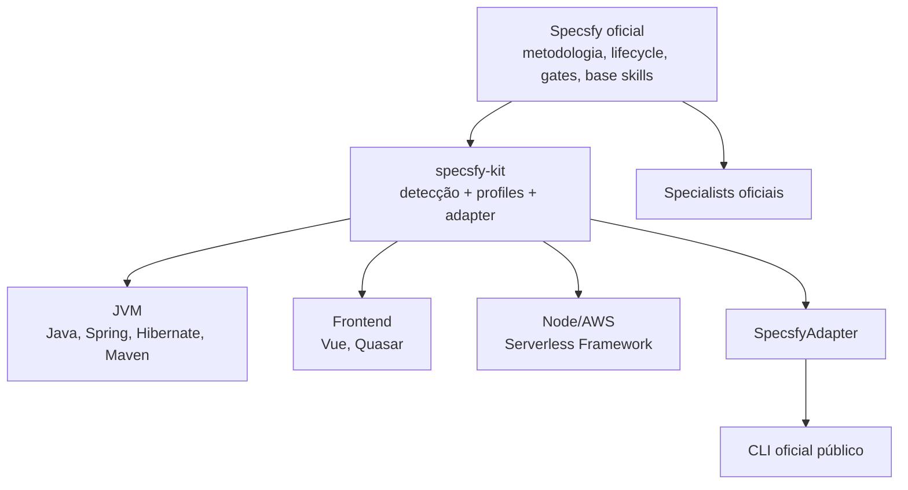

# specsfy-kit

Camada de distribuição, profiles e specialists externos sobre o
[Specsfy oficial](https://github.com/promovaweb/specsfy). O kit não é fork e
não substitui a metodologia SDD, os gates, as base skills ou o CLI oficial.

## Quick start

Execute o fluxo recomendado:

```bash
npm install --global @promovaweb/specsfy
npm install --global https://github.com/Cadlira/specsfy-kit/archive/refs/heads/main.tar.gz

cd meu-projeto
specsfy-kit init
```

> **Não execute `specsfy setup` manualmente antes de `specsfy-kit init`.** O
> kit resolve o profile primeiro e então orquestra o setup oficial.

O tarball é o único método de instalação recomendado. No Windows com NVM for
Windows, o npm 10 pode retornar sucesso ao instalar por `github:` enquanto
deixa uma junction apontando para um clone temporário já removido. O tarball
materializa o pacote e foi validado com Node.js 22.22.2 e npm 10.9.7.

## O problema resolvido

Uma stack descreve o que existe. Um profile descreve como o projeto deve ser
tratado. Specialists adicionam conhecimento e guardrails. Essa separação
permite, por exemplo, tratar a mesma stack Java/Spring/Hibernate como
manutenção conservadora em `main` e modernização incremental em
`modernizacao/**`, inclusive em dois worktrees simultâneos.



## Pré-requisitos

Conforme o Specsfy oficial 0.8.1 consultado em 20/08/2026:

- Node.js 22.20.0 ou superior;
- o npm fornecido com a instalação ativa do Node.js;
- Git;
- acesso de escrita ao projeto;
- requisitos de rede/autenticação exigidos pelo Specsfy para obter o catálogo.

Verifique:

```bash
node --version
npm --version
git --version
```

## Instalação do Specsfy oficial

O `specsfy-kit` não incorpora nem substitui o Specsfy:

```bash
npm install --global @promovaweb/specsfy
specsfy --version
```

O pacote oficial inclui o `skills`; instalações alternativas do Specsfy podem
usar um `skills` global ou `npx`. Para atualizar somente o CLI oficial:

```bash
specsfy upgrade
```

O upgrade global nunca é executado silenciosamente pelo kit.

## Instalação do specsfy-kit

Instalação recomendada pelo tarball HTTPS da branch `main`:

```bash
npm install --global https://github.com/Cadlira/specsfy-kit/archive/refs/heads/main.tar.gz
specsfy-kit --version
specsfy-kit profiles list
```

O `dist/` é versionado para que a instalação global pelo tarball não dependa de
`devDependencies` nem execute lifecycle no ambiente consumidor. O npm 10.9.7
no Windows pode deixar a instalação `github:` ligada a um clone temporário e
retornar exit code 0; por isso esse formato não deve ser usado. A instalação
por tarball foi validada com todos os 11 specialists. Antes de cada commit de
release, `npm run build` deve atualizar o binário `dist/cli/main.js`; `npm run
check` valida código, testes e pacote.

Uma versão pinada poderá ser instalada quando existir uma tag:

```bash
# Exemplo futuro; requer a tag correspondente no repositório.
npm install --global https://github.com/Cadlira/specsfy-kit/archive/refs/tags/v0.1.2.tar.gz
```

## Configuração do zero em um projeto

```bash
# 1. confirmar pré-requisitos
node --version
npm --version
git --version

# 2. instalar o Specsfy oficial, sem executar setup do projeto
npm install --global @promovaweb/specsfy
specsfy --version

# 3. instalar o kit
npm install --global https://github.com/Cadlira/specsfy-kit/archive/refs/heads/main.tar.gz
specsfy-kit --version

# 4. entrar no projeto
cd caminho/do/projeto

# 5. opcional: detectar sem escrever
specsfy-kit detect

# 6. escolher profiles e inicializar
specsfy-kit init

# 7. conferir
specsfy-kit status
specsfy-kit doctor
```

Fluxo correto:

```text
instalar CLI Specsfy → instalar specsfy-kit → specsfy-kit init
```

Fluxo incorreto:

```text
specsfy setup → specsfy-kit init
```

`init` detecta a stack, mostra sugestões, recebe a escolha explícita, persiste
`.specsfy-kit.yml`, executa `specsfy doctor`, orquestra `specsfy setup`, instala
specialists e gera o lock. Em CI, informe profiles explicitamente:

```bash
specsfy-kit init \
  --profile java-modernization \
  --profile vue-quasar \
  --yes
```

Em PowerShell, use crase ou uma única linha no lugar de `\`.

## Instalação para desenvolver o kit

```bash
git clone https://github.com/Cadlira/specsfy-kit.git
cd specsfy-kit
npm install
npm test
npm run lint
npm run typecheck
npm run build
```

## Comandos

| Comando | Responsabilidade |
| --- | --- |
| `specsfy-kit init` | escolhe profiles antes do setup oficial |
| `specsfy-kit detect [--json]` | detecta stack; somente leitura |
| `specsfy-kit sync` | recalcula branch/worktree e reconcilia assets |
| `specsfy-kit status [--json]` | mostra resolução, instalação e drift |
| `specsfy-kit doctor [--json]` | verifica pré-requisitos; não instala |
| `specsfy-kit progress [--json]` | exibe o progresso oficial das specs |
| `specsfy-kit test` | detecta e executa Maven, Gradle e scripts Node |
| `specsfy-kit update` | atualiza assets oficiais e do kit |
| `specsfy-kit profiles list` | lista profiles |
| `specsfy-kit profiles show <nome>` | detalha intenção e specialists |

Operações mutáveis aceitam `--dry-run`; `init`, `sync` e `update` aceitam
`--force` para assets kit-owned alterados. `init`, `sync` e `update` aceitam
`--profile` repetível. Use `--json` em automação.

## Progresso das specs

O kit expõe o progresso calculado pelo CLI oficial, sem manter um parser
paralelo:

```bash
specsfy-kit progress
specsfy-kit progress --json
```

O comando encaminha `--project` ao `specsfy progress` por meio do
`SpecsfyAdapter`, preserva a saída oficial e não altera arquivos. Os números
são os mesmos usados pela TUI/dashboard do Specsfy.

## Testes nativos da stack

O Specsfy oficial 0.8.1 limita `specsfy test` a projetos Laravel com Pest. O
kit não altera esse comando e oferece um runner complementar:

```bash
specsfy-kit test
specsfy-kit test --dry-run
specsfy-kit test --verify
specsfy-kit test --json
specsfy-kit test --runner maven
specsfy-kit test -- --tests UserServiceTest
```

A resolução prioriza `mvnw`/`mvnw.cmd` e `gradlew`/`gradlew.bat`; na ausência
do wrapper usa Maven ou Gradle do `PATH`. Projetos Node usam o script `test` e
o gerenciador declarado em `packageManager` ou indicado pelo lockfile. npm é o
fallback. No modo `--verify`, Maven executa `verify`, Gradle executa `check` e
scripts Node continuam executando `test`.

Em monorepos, um POM agregador, um build com `settings.gradle` ou um workspace
Node com script `test` possui seus módulos, evitando duplicação. Runners
independentes — por exemplo backend Maven e frontend npm — são executados em
sequência. Todos são executados e qualquer exit code diferente de zero faz o
comando terminar com falha.

`--dry-run` apenas mostra comandos e diretórios. `--json` captura stdout e
stderr dos runners e emite um único documento. Argumentos específicos devem
ser colocados após `--`; eles são repassados como argumentos separados, sem
interpolação por shell.

## Profiles

- `java-legacy`: preservação conservadora; impede modernização incidental.
- `java-modernization`: passos incrementais e characterization tests; upgrades
  somente quando previstos pela spec.
- `spring-boot-service`: somente quando Spring Boot foi realmente detectado.
- `vue-quasar`: respeita versões, API Vue, boot files e convenções Quasar.
- `serverless-node`: preserva stages, variables, IAM, packaging e handlers.

`java-legacy` e `java-modernization` conflitam. A detecção sugere, mas não
decide intenção perigosa. Sem `--profile`, `init` pergunta em terminal; sem TTY
ele falha claramente.

Projeto simples:

```bash
cd meu-microservico
specsfy-kit init --profile spring-boot-service --yes
```

```yaml
schemaVersion: 1
defaultProfiles:
  - spring-boot-service
branchProfiles: []
overrides:
  addSpecialists: []
  removeSpecialists: []
```

## defaultProfiles e branchProfiles

A precedência é:

```text
CLI override > branchProfiles > defaultProfiles
```

`replace` substitui todo o conjunto corrente; `add` compõe e deduplica. Regras
matched são aplicadas na ordem declarada.

```yaml
schemaVersion: 1
defaultProfiles:
  - java-legacy
branchProfiles:
  - pattern: "modernizacao/**"
    replace:
      - java-modernization
  - pattern: "migration/**"
    replace:
      - java-modernization
  - pattern: "frontend/**"
    add:
      - vue-quasar
overrides:
  addSpecialists: []
  removeSpecialists: []
```

### `main` → `java-legacy`

```bash
git checkout main
specsfy-kit sync
specsfy-kit status
```

```text
Branch: main
Active profiles: java-legacy
Source: defaultProfiles
```

### `modernizacao/**` → `java-modernization`

```bash
git checkout modernizacao/java21
specsfy-kit sync
specsfy-kit status
```

```text
Branch: modernizacao/java21
Active profiles: java-modernization
Source: branch rule modernizacao/**
```

A stack ainda Java 8/Spring 3 no começo dessa branch é válida. A regra exprime
intenção; `sync` não troca o profile com base na versão detectada.

## Git worktrees

```bash
git worktree add ../projeto-java21 modernizacao/java21
cd ../projeto-java21
specsfy-kit sync
specsfy-kit status
```

O kit obtém a branch com `git branch --show-current` e o runtime com
`git rev-parse --git-path specsfy-kit/runtime.json`. O Git retorna um caminho
distinto para cada worktree. Assim, o worktree em `main` mantém `java-legacy`
enquanto o linked worktree usa `java-modernization`, sem alterar a configuração
ou o lock por checkout. Há teste automatizado criando worktrees Git reais e
comprovando esse isolamento.

## Detecção

O scanner é limitado por profundidade e quantidade de entradas e ignora `.git`,
`node_modules`, `target`, `build`, `dist`, `coverage` e `out`. Cada evidência
possui tecnologia, versão, confiança e origem.

- Java: Maven/Gradle, target/release, multi-module, Spring Framework, Spring
  Boot, Hibernate, JUnit, Mockito e AssertJ.
- Frontend: package manifest, Vue, Quasar, TypeScript, Vite e testes.
- Node/AWS: Node, Serverless Framework, provider AWS, Lambda e testes.
- Monorepos: manifests relevantes em subdiretórios.

Quando não há resolução segura, a versão é `unknown`. O detector não implementa
um effective POM completo e jamais deduz Boot pela versão moderna do Java.

## Specialists e integração oficial

Specialists kit-owned:

```text
specsfy-specialist-java
specsfy-specialist-java-testing
specsfy-specialist-maven
specsfy-specialist-spring-framework
specsfy-specialist-spring-boot
specsfy-specialist-hibernate
specsfy-specialist-legacy-modernization
specsfy-specialist-vue
specsfy-specialist-quasar
specsfy-specialist-node
specsfy-specialist-serverless-framework
```

Specialists oficiais úteis — TypeScript, UI/UX, acessibilidade, API, arquitetura
e segurança — são instalados somente quando existem no catálogo oficial e são
gerenciados pelo Specsfy. Extensões do kit são Agent Skills externas em
`.agents/skills`, com hashes em `.specsfy-kit/ownership.json`.

`SPECSFY_SPECIALISTS_CATALOG` substitui o catálogo oficial; não faz merge. O
kit não a usa. Veja [a integração pesquisada](docs/specsfy-integration.md).

## Ownership, configuração e lock

- Specsfy-owned: base skills, assets `.specsfy` e specialists oficiais.
- Kit-owned: os 11 specialists, bloco delimitado em `AGENTS.md` e manifest.
- User-owned: código, manifests, texto fora dos marcadores e templates custom.

O kit não altera `pom.xml`, `package.json`, código, framework, migrations ou
hooks. Drift kit-owned interrompe a atualização sem `--force`.

Recomenda-se commitar `.specsfy-kit.yml`, `.specsfy-kit.lock.json`, specialists
materializados e ownership. O lock representa o baseline de `defaultProfiles`
e é atualizado em `init/update`. Runtime branch-aware é local ao Git dir e não
é commitado.

## Atualização

### Atualizar o Specsfy oficial

```bash
specsfy upgrade
```

Para atualizar diretamente assets oficiais de um projeto:

```bash
specsfy update --project .
```

Normalmente, após instalar uma nova versão do kit, use `specsfy-kit update`,
que orquestra o update de projeto oficial e depois reconcilia extensões. Ele
não executa `upgrade` global, salvo opção explícita:

```bash
specsfy-kit update --upgrade-specsfy
```

### Atualizar o specsfy-kit

```bash
npm install --global https://github.com/Cadlira/specsfy-kit/archive/refs/heads/main.tar.gz --force
cd caminho/do/projeto
specsfy-kit update
specsfy-kit status
```

## CI e dry-run

```bash
specsfy-kit detect --json
specsfy-kit init --profile serverless-node --yes --dry-run --json
specsfy-kit sync --dry-run --json
specsfy-kit doctor --json
specsfy-kit test --dry-run --json
specsfy-kit test --json
```

`--dry-run` não grava configuração/runtime/lock, não instala skills e não chama
o Specsfy. JSON usa campos estáveis; timestamps e caminhos continuam sendo
dados do ambiente.

## Exemplos por stack

```bash
# Java legado conservador
specsfy-kit init --profile java-legacy --yes

# Java 21 com Spring 4/Hibernate 4 em modernização planejada
specsfy-kit init --profile java-modernization --yes

# Spring Boot comprovado no POM/Gradle
specsfy-kit init --profile spring-boot-service --yes

# Vue + Quasar
specsfy-kit init --profile vue-quasar --yes

# Node + Serverless Framework
specsfy-kit init --profile serverless-node --yes

# Monorepo composto
specsfy-kit init --profile java-modernization --profile vue-quasar --yes
```

## Troubleshooting

- `executável Specsfy não encontrado`: instale o pacote oficial e confira
  `specsfy --version`; no Windows, confirme que o bin global npm está no PATH.
- `ambiente não interativo requer...`: passe um ou mais `--profile` e `--yes`.
- `profiles conflitantes`: escolha a intenção correta; `--force` é um override
  explícito e deve ser usado somente após revisão.
- `possui alterações locais`: revise o diff do asset kit-owned; preserve a
  customização ou repita com `--force`.
- catálogo indisponível: satisfaça a autenticação/rede exigida pelo Specsfy.
- `runtimeStale: true`: execute `specsfy-kit sync` após checkout.
- `nenhum runner de teste suportado`: adicione um script `test` ao
  `package.json` ou use um projeto Maven/Gradle; runners custom devem ser
  executados diretamente.
- `specsfy test` espera Pest: em stacks Java/Node use `specsfy-kit test`.
- versão `unknown`: declare a intenção pelo profile; não invente uma versão.

## Desinstalação

```bash
# remover apenas o kit global
npm uninstall --global specsfy-kit

# remover apenas o Specsfy oficial
npm uninstall --global @promovaweb/specsfy
```

Nenhum desses comandos apaga configuração ou assets já existentes nos
projetos. Remoção de artefatos de projeto deve ser revisada e feita
explicitamente pelo usuário.

## Arquitetura do repositório

```text
src/
├── cli/            comandos e apresentação
├── config/         schema YAML e lock
├── core/           workflows, doctor e tipos
├── detection/      scanner e detectores Java/Node
├── git/            branch, worktree e runtime
├── ownership/      fingerprints kit-owned
├── profiles/       definições e resolução
├── specialists/    instalação externa
├── testing/        detecção e execução de runners nativos
└── specsfy/        SpecsfyAdapter
specialists/        11 Agent Skills distribuídas
profiles/           catálogo legível
fixtures/           stacks e cenários Git
tests/              unidade, integração e worktrees
docs/adr/           decisões arquiteturais
```

## Limitações do MVP

- Maven/Gradle são analisados estaticamente; parent remoto e lógica de build
  arbitrária podem resultar em `unknown`.
- Detached HEAD aparece como `DETACHED` e só usa regra que corresponda a esse
  texto; normalmente cai em `defaultProfiles`.
- Instalação oficial depende da disponibilidade do catálogo e da rede do
  Specsfy.
- Templates customizados não são criados pelo kit; a extensão oficial já está
  preparada em `.specsfy/templates/custom/`.
- Não há hooks, daemon, telemetry, servidor ou atualização em background.
- Runners customizados fora de Maven, Gradle e scripts Node não são inferidos.

## ADRs

As decisões de não-fork, ordem do setup, intenção, ownership, config/lock,
branches, worktrees, sync e distribuição por tarball HTTPS estão em [docs/adr](docs/adr/).
